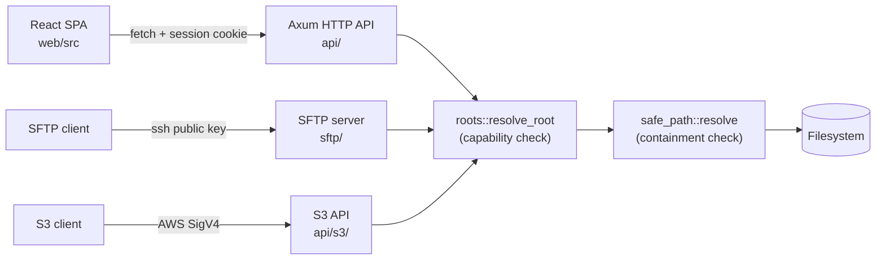

**NASDrive** is a self-hosted web file manager. A single Rust binary serves the
HTTP API, an SSH/SFTP server, and an S3-compatible object API over the same
storage roots, the same user identities, and the same permission model. The
React frontend is compiled into that binary as static assets.

These tours follow real control flow through the code — from a click in the
browser, down through the Axum handlers, to the bytes on disk and back.

### The one thing to understand first

Every one of the three protocols reaches the disk through the same two gates,
in the same order:

1. [`roots::resolve_root`](glossary:root) decides **whether this user may touch
   this root at all** — a pure capability check, made before the filesystem is
   consulted.
2. [`safe_path::resolve`](glossary:safe-path) decides **whether the requested
   path stays inside that root** — canonicalizing both sides so that `..` and
   symlinks cannot escape.

If you only read one thing, read those two functions. Everything else in these
tours is plumbing that leads to them.

### Where to start

- **Authentication** — a login, a second factor, a session, and how every
  subsequent request re-validates the user.
- **Share management** — the lifecycle of a share link, from the dialog that
  creates it to the stranger who redeems it.
- **File copy & move** — a drag-and-drop turned into a durable, resumable
  background job.
- **SFTP server** — public-key auth, the virtual root, and per-operation
  permission revalidation.
- **S3-compatible API** — SigV4 verification, bucket-to-root mapping, and
  multipart uploads.

Pick any tour from the overview, or browse the components below.
