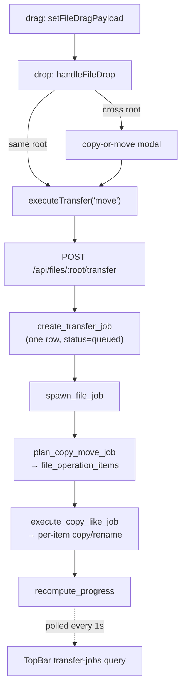

Drag a folder onto another folder. That gesture becomes a durable, resumable,
cancellable background job — and this tour follows every stage of it.

The architecture is worth stating up front, because the HTTP handler is
deliberately almost empty:

The handler validates *nothing*. Every ACL and path check is deferred to the
worker, on purpose: a job recovered after a server restart must re-run those
checks with the original caller's permissions, so the worker has to be able to
do them anyway. Storing the whole `AuthUser` on the job row is what makes that
possible.

Also note that progress is never incremented — it is always **recomputed** from
an aggregate query over the item table, so a crash mid-copy cannot leave the
counters skewed.
